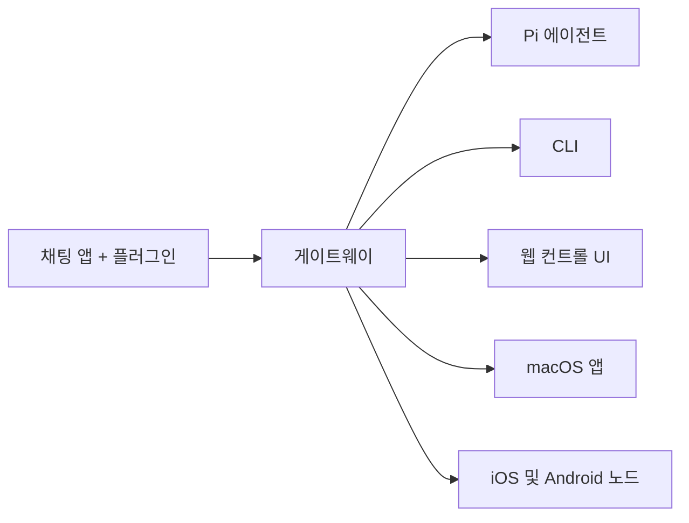

```markdown
---
read_when:
  - 새로운 사용자에게 OpenClaw 를 소개할 때
summary: OpenClaw 는 모든 OS 에서 작동하는 AI 에이전트용 멀티채널 게이트웨이입니다.
title: OpenClaw
x-i18n:
  generated_at: "2026-02-08T17:15:47Z"
  model: claude-opus-4-5
  provider: pi
  source_hash: fc8babf7885ef91d526795051376d928599c4cf8aff75400138a0d7d9fa3b75f
  source_path: index.md
  workflow: 15
---

# OpenClaw 🦞

<p align="center">
    
    
</p>

> _「EXFOLIATE! EXFOLIATE!」_ — 아마도 우주 로브스터

<p align="center">
  <strong>WhatsApp, Telegram, Discord, iMessage 등 다양한 OS 에서 AI 에이전트를 지원하는 게이트웨이.</strong><br />
  메시지를 보내면 주머니에서 에이전트의 응답을 받을 수 있습니다. 플러그인을 통해 Mattermost 등을 추가할 수 있습니다.
</p>

<Columns>
  <Card title="시작하기" href="/start/getting-started" icon="rocket">
    OpenClaw 를 설치하고 몇 분 안에 게이트웨이를 시작할 수 있습니다.
  </Card>
  <Card title="마법사 실행" href="/start/wizard" icon="sparkles">
    `openclaw onboard` 및 페어링 플로우를 통한 가이드 설정.
  </Card>
  <Card title="Control UI 열기" href="/web/control-ui" icon="layout-dashboard">
    채팅, 설정, 세션을 위한 브라우저 대시보드를 시작합니다.
  </Card>
</Columns>

OpenClaw 는 단일 게이트웨이 프로세스를 통해 채팅 앱을 Pi 와 같은 코딩 에이전트에 연결합니다. OpenClaw 어시스턴트를 구동하고, 로컬 또는 원격 설치를 지원합니다.

## 작동 원리



게이트웨이는 세션, 라우팅, 채널 연결의 신뢰할 수 있는 유일한 정보원입니다.

## 주요 기능

<Columns>
  <Card title="멀티채널 게이트웨이" icon="network">
    단일 게이트웨이 프로세스로 WhatsApp, Telegram, Discord, iMessage 를 지원합니다.
  </Card>
  <Card title="플러그인 채널" icon="plug">
    확장 패키지를 통해 Mattermost 등을 추가.
  </Card>
  <Card title="멀티 에이전트 라우팅" icon="route">
    에이전트, 워크스페이스, 발신자 별로 분리된 세션.
  </Card>
  <Card title="미디어 지원" icon="image">
    이미지, 오디오, 문서의 송수신.
  </Card>
  <Card title="웹 컨트롤 UI" icon="monitor">
    채팅, 설정, 세션, 노드를 위한 브라우저 대시보드.
  </Card>
  <Card title="모바일 노드" icon="smartphone">
    Canvas 지원 iOS 및 Android 노드 페어링.
  </Card>
</Columns>

## 빠른 시작

<Steps>
  <Step title="OpenClaw 설치">
    ```bash
    npm install -g openclaw@latest
    ```
  </Step>
  <Step title="온보딩 및 서비스 설치">
    ```bash
    openclaw onboard --install-daemon
    ```
  </Step>
  <Step title="WhatsApp 을 페어링하고 게이트웨이 시작">
    ```bash
    openclaw channels login
    openclaw gateway --port 18789
    ```
  </Step>
</Steps>

전체 설치 및 개발 설정이 필요하신가요? [빠른 시작](/start/quickstart)을 참조하세요.

## 대시보드

게이트웨이 시작 후 브라우저에서 Control UI 를 엽니다.

- 로컬 기본값: [http://127.0.0.1:18789/](http://127.0.0.1:18789/)
- 원격 액세스: [웹 서페이스](/web) 및 [Tailscale](/gateway/tailscale)

<p align="center">
  
</p>

## 설정 (옵션)

설정은 `~/.openclaw/openclaw.json`에 있습니다.

- **아무것도 하지 않으면**, OpenClaw 는 번들된 Pi 바이너리를 RPC 모드로 사용하여 발신자별 세션을 생성합니다.
- 제한을 설정하려면 `channels.whatsapp.allowFrom` 및 (그룹의 경우) 멘션 규칙부터 시작하세요.

예:

```json5
{
  channels: {
    whatsapp: {
      allowFrom: ["+15555550123"],
      groups: { "*": { requireMention: true } },
    },
  },
  messages: { groupChat: { mentionPatterns: ["@openclaw"] } },
}
```

## 여기서 시작하기

<Columns>
  <Card title="문서 허브" href="/start/hubs" icon="book-open">
    사용 사례별로 정리된 모든 문서와 가이드.
  </Card>
  <Card title="설정" href="/gateway/configuration" icon="settings">
    게이트웨이의 핵심 설정, 토큰, 프로바이더 설정.
  </Card>
  <Card title="원격 액세스" href="/gateway/remote" icon="globe">
    SSH 및 tailnet 액세스 패턴.
  </Card>
  <Card title="채널" href="/channels/telegram" icon="message-square">
    WhatsApp, Telegram, Discord 등 채널별 설정.
  </Card>
  <Card title="노드" href="/nodes" icon="smartphone">
    페어링 및 Canvas 지원 iOS 및 Android 노드.
  </Card>
  <Card title="도움말" href="/help" icon="life-buoy">
    일반적인 수정 및 문제 해결의 진입점.
  </Card>
</Columns>

## 자세한 내용

<Columns>
  <Card title="전체 기능 목록" href="/concepts/features" icon="list">
    채널, 라우팅, 미디어 기능의 전체 목록.
  </Card>
  <Card title="멀티 에이전트 라우팅" href="/concepts/multi-agent" icon="route">
    워크스페이스 분리 및 에이전트별 세션.
  </Card>
  <Card title="보안" href="/gateway/security" icon="shield">
    토큰, 허용 목록, 안전 제어.
  </Card>
  <Card title="문제 해결" href="/gateway/troubleshooting" icon="wrench">
    게이트웨이 진단 및 일반 오류.
  </Card>
  <Card title="개요 및 크레딧" href="/reference/credits" icon="info">
    프로젝트 출처, 기여자, 라이선스.
  </Card>
</Columns>
```